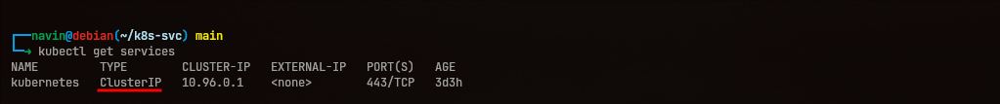
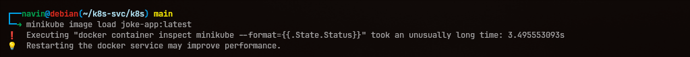
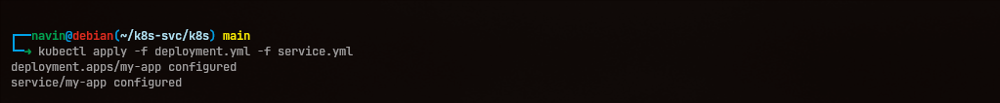
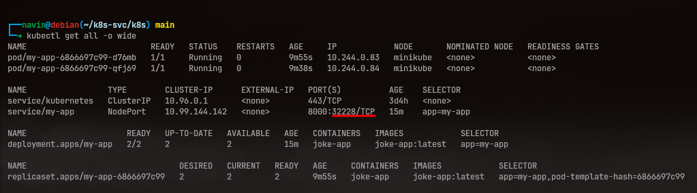

## All about k8s services

In k8s, a Service is an abstraction that provides a stable virtual IP (and DNS name) which forwards traffic to one or more Pods. It enables pod-to-pod communication and, depending on the Service type, access from outside the cluster.

- Pods in `k8s` are ephemeral — they are designed to be disposable and replaceable.
- That means if a Pod dies its IP changes and any data stored only on the Pod is lost.

For example, if an `nginx` container is running in a Deployment and you're accessing it by the Pod IP, that IP may change when the Pod is recreated. A Service provides a stable IP or DNS name and selects Pods by labels, solving this dynamic IP lifecycle problem.

## Reasons to use a Service

- Service discovery: If a Pod dies and is recreated, instead of tracking it by IP the Service uses labels and selectors to target the correct Pods.

- Load balancing: A Service routes traffic to matching Pods (kube-proxy implements simple load balancing, commonly round-robin or iptables/ipvs rules).

- Exposing applications: By default, Pods are only reachable inside the cluster network. Services (depending on type) enable access from other nodes or from outside the cluster.

## Types of Services

1. ClusterIP
2. NodePort
3. LoadBalancer

### More on k8s architecture

A Service is a network abstraction that works with the cluster networking to provide a stable virtual IP and DNS name for a set of Pods.

In my setup I am using `minikube`, which creates a single-node Kubernetes cluster (often inside a VM or container). Every Pod in this cluster runs on that single node.

#### Understanding internal networking

- The Minikube node has an IP on the host network.
- A Service (ClusterIP) provides a virtual IP that is reachable inside the cluster network.
- Each Pod also has its own IP which is typically only reachable from other Pods or from the node, depending on networking configuration.

---

## 1. ClusterIP

ClusterIP is the default Service type. It provides internal connectivity within the cluster using a virtual IP (ClusterIP) that is only accessible from inside the cluster.



To access a ClusterIP Service from your host machine you can either run commands inside the node (for minikube: `minikube ssh`) or use tools like `kubectl port-forward`, `kubectl proxy`, or `minikube service --url` to expose/forward traffic locally.

```bash
minikube ssh
```


## 2. NodePort

NodePort exposes the Service on a port on every Node IP. The Service is still backed by a ClusterIP, but Kubernetes also opens a port (typically in the range 30000-32767) on each Node and forwards traffic received on that port to the Service.

You can curl the Node's IP and the NodePort from your host to reach the Service; kube-proxy will then forward the request to one of the matching Pods (simple load balancing).

Let's try that out on this `joke-app` project.

### Create a deployment file

```yml
apiVersion: apps/v1
kind: Deployment
metadata:
  creationTimestamp: null
  labels:
    app: my-app
  name: my-app
spec:
  replicas: 2 
  selector:
    matchLabels:
      app: my-app
  strategy: {}
  template:
    metadata:
      creationTimestamp: null
      labels:
        app: my-app
    spec:
      containers:
      - image: joke-app:latest
        imagePullPolicy: Never
        name: joke-app
        resources: {}
status: {}
```

### Create a service config file

```yml
apiVersion: v1
kind: Service
metadata:
  creationTimestamp: null
  labels:
    app: my-app
  name: my-app
spec:
  ports:
  - port: 8000
    protocol: TCP
    targetPort: 8000
  selector:
    app: my-app
  type: NodePort
status:
  loadBalancer: {}
```

> In my case, i am running this entirely inside my vm.  
> I have to load the image inside the minikube for it to access.



### Apply the config files

Next step is to use the YAML files to create the Deployment and Service.

```bash
kubectl apply -f deployment.yml -f service.yml
```



### Check the service

Now the setup is done.
Just to ensure everything worked properly use the given command to check current status,

```bash
kubectl get all -o wide
```

The output should look something similar:



Now we can use the exposed Minikube Node IP and NodePort (in my case: `192.168.49.2:32228`) to send requests to the Service.

> Note: On a single-node minikube setup you can inspect the node interfaces with `ip -br a` to find the node IP used by minikube.

```bash

┌──navin@debian(~)
└─➜ ip -br a
lo               UNKNOWN        127.0.0.1/8 ::1/128 
enp1s0           UP             192.168.122.19/24 fe80::332d:ae6:8f2d:2068/64 
docker0          DOWN           172.17.0.1/16 
br-535d8ef080cc  UP             192.168.49.1/24 fe80::80c3:52ff:fe87:332/64 
veth58188c7@if2  UP             fe80::7c05:e0ff:fe47:e32a/64
```

Now simply access the service through host machine.

```bash
┌──navin@debian(~/k8s-svc/k8s) main
└─➜ curl 192.168.49.2:32228/jokes/random
{"id":1,"joke":"Why do programmers prefer dark mode? Because light attracts bugs."}
```
